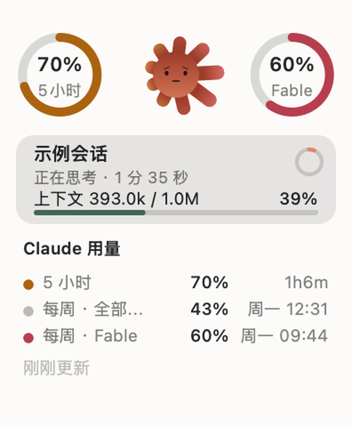

# Sundial · 日晷

一只停在桌面上的小太阳，显示 Claude Code 的实时会话状态和用量限额。
macOS 与 Windows 双平台。

**不需要订阅也能用**——会话状态那半边读的是本地文件，装上就能看；
只有两个用量圈需要 Claude Max / Pro。



---

## 下载

到 [Releases](../../releases) 拿最新版：

| 平台 | 文件 | 说明 |
|---|---|---|
| macOS 13+ | `Sundial-x.y.z-macOS.zip` | 通用二进制，Intel 与 Apple 芯片都能跑 |
| Windows 10/11 | `Sundial-x.y.z-Windows-x64.exe` | 自包含，不用装 .NET |

**macOS 首次打开**：没有经过 Apple 公证，系统会拦一下。

```bash
xattr -dr com.apple.quarantine /Applications/Sundial.app
```

**Windows 首次打开**：SmartScreen 会弹蓝框（没买微软的代码签名证书），
点「更多信息 → 仍要运行」。

---

## 功能

### 两个用量仪表（需要 Max / Pro）

太阳左右各一个圈，中间是百分比，下面是标签。

- **左圈（蜜金色）** = 5 小时限额
- **右圈（杏粉色）** = 所有周限额里**用得最紧**的那一条。
  可能是「每周 · 全部模型」，也可能是某个模型的专属限额（比如 Fable），
  哪条最紧就显示哪条，标签会跟着变。

细节：

- 弧从正上方**顺时针**填充，数值变化时平滑缓动
- **超限如实显示**。接口返回 106% 就写 106%，不夹到 100——
  夹住只会让人以为"刚好用完"，看不出超了多少
- 圆环的缓动值**按位置记而不是按标签记**。右圈显示的限额是会换人的，
  按标签记的话换人时新标签没有历史值、要从 0 长起来，
  看着像用量突然清零（实测会从 216° 一帧掉到 54°）

### 太阳本身就是指示器

即使收起成一颗太阳，扫一眼也能读出状态：

- **表情**跟着用量走：轻松时咧嘴笑 → 用了一半抿成一条线 → 快满了皱眉。
  眉毛只在紧张后才长出来，内高外低
- **身体颜色**随用量连续加深（不是分档跳变）
- **光芒尖端**渐变成对应那侧仪表的颜色，**越满越亮**。
  渐变只上在远端、根部保持本色——颜色是从仪表那边"蹭"过来的
- **光芒长度**被两侧仪表拉扯：哪边限额紧，光芒就往哪边被拽长，
  而且是**一吸一斥的呼吸**（正半周拽出去、负半周收回来），
  用量越高喘得越急。两侧相位相反，整圈像左右摇曳
- **鼠标引力**：光标靠近时（隔空就开始，不用进窗口）光芒被吸过去、
  身体微微前倾、眼珠跟着看、笑得更开。打盹时反过来——光芒躲开、身体后缩
- **打盹**：没有会话在跑时变灰、闭眼、冒 zzz。
  但用量信号仍然保留（尖端发光的强度），不至于什么都读不到

### 会话块

每个正在跑的 Claude Code 会话一块，最多 4 块：

- 会话标题、正在做什么、**本轮已经跑了多久**
- **上下文占用**（如 `824.8k / 1.0M`，82%）。条子过 60% 开始变深红，
  快满时该考虑新开会话了。这个数不需要订阅
- 状态：`正在思考` / `等你选择`（抛出选项时会**排到最上面**）/
  `后台任务运行中` / `未读 · 刚刚完成` / `无响应 · 已 N 分无更新`
- 点一下把「跑完了还没看」的提示消掉
- 出现和消失是**卷动式**的，下面的块同步上滑，不会凭空跳出跳没

时间判定上踩过不少坑，都已修：回合起点锚在用户消息本身（用 `last-prompt`
定位会晚 112 秒）、Esc 中断会清起点、API 报错的占位记录不当作回合结束、
超时只报「无响应」而不谎称跑完。

### 界面

- **空闲时只剩一颗太阳**浮在桌面上，没有卡片也没有底
- 鼠标移上去展开，移开收起。收起用 S 形缓动（0.62 秒），
  仪表比窗口先淡出——否则会被窗口边缘切掉，看着像"啪"地消失
- macOS 上卡片是系统的 **Liquid Glass**（`NSGlassEffectView`）；
  Windows 上是自绘的半透明圆角底（原因见下方"已知限制"）
- 跟随系统**明暗模式**自动切换，两套配色都逐项量过对比度
- 拖动可移动，位置记得住；等待输入时玻璃会染上暖色
- **菜单栏 / 托盘**也有一颗小太阳，**有会话在跑时它会转**

### 其它

- 右键菜单：登录 / 退出登录、立即刷新、固定展开明细、打开网页版用量、
  更通透的玻璃、始终置顶、开机自启、把桌宠移回屏幕中央、退出
- 菜单最上面显示当前版本号，报问题时先看这个
- 尊重系统无障碍设置：**减弱动态效果**（关掉跟手位移）、
  **降低透明度**（改画不透明背板）
- 省电：空闲降到 24fps，显示器休眠时完全停下，磁盘轮询也停

---

## 不需要订阅的用法

这个 App 的两半是分开的：

| | 数据来源 | 需要账号吗 |
|---|---|---|
| 会话状态、上下文占用 | 本地 `~/.claude` 下的记录文件 | **不需要** |
| 两个用量圈 | Anthropic 的接口 | 需要 Max / Pro |

没有订阅时，Claude 的授权页会直接写「连接 Claude Code 需要 Claude Max 或 Pro」
并拒绝连接——**这是正常的，跳过登录即可**，太阳和会话块照常工作。

授权页上写的「或使用 API 密钥」对这个用途没用：那是另一套计费方式，
没有"订阅用量"这个数可显示。

---

## 自己构建

```bash
# macOS（需要 Xcode 命令行工具）
cd 源码
./build.sh              # 本机调试，装到桌面
./build.sh share        # 通用二进制（Intel + Apple 芯片），打包到 发给朋友/
./build.sh release      # 需要 Developer ID 证书，含公证

# 图标（改了太阳造型才需要重跑）
./图标/生成图标.sh          # 浅色底
./图标/生成图标.sh dark     # 深色底

# Windows 版（在 macOS 上交叉编译，需要 .NET 10 SDK：brew install dotnet）
cd Windows源码
./构建.sh x64           # win-x64
./构建.sh arm64         # win-arm64（骁龙 X 这类）
./构建.sh check         # 只跑验证：Core 逻辑 + 离屏渲染出 PNG
```

版本号的唯一来源是仓库根的 `VERSION` 文件，两个构建脚本都从它读。

---

## 仓库结构

```
VERSION                     版本号唯一来源
源码/                       macOS 版（Swift + AppKit）
  ├ PetView.swift           全部绘制与动画状态
  ├ App.swift               窗口、菜单、托盘、能耗、无障碍
  ├ Activity.swift          读 Claude Code 会话记录
  ├ Usage.swift             用量接口解析与取数调度
  ├ Auth.swift              OAuth PKCE 与令牌存储
  ├ Model.swift / Theme.swift
  └ 图标/                   图标生成器
Windows源码/                Windows 版（C# + Avalonia）
  ├ src/Sundial.Core/       纯逻辑，不依赖 UI —— 可在 macOS 上跑测试
  ├ src/Sundial.App/        Avalonia 界面
  └ tests/
     ├ LiveCheck/           拿本机真实记录跑 Core 层
     └ RenderCheck/         离屏渲染成 PNG，与 macOS 版逐帧比对
说明.md                     维护说明：设计决定与踩过的坑
```

两个平台共用同一套造型参数与行为逻辑，15 项关键常量逐个比对保持一致。

---

## 数据与隐私

- 会话那半边**只读本地文件**，而且只看类型、时间戳、忙闲标记和 token 计数，
  **不读对话正文**
- 登录令牌只存在本地：macOS 在应用支持目录（权限 0600），
  Windows 用 DPAPI 加密（只有你的账户能解开）
- 不上传任何东西，没有统计，没有崩溃收集

---

## ⚠️ 请先读这一段

**这是一个非官方的个人项目，与 Anthropic 没有任何关系。**

有两处依赖是不受保障的：

1. **它复用了 Claude Code 自己的 OAuth `client_id`**，而不是独立申请的凭据。
   这个 ID 本身不是秘密，但用第三方程序走它的授权流程**可能不符合 Anthropic
   的服务条款**。风险由使用者自负；也不排除这条流程日后被收紧。
2. **用量数据取自未公开接口** `GET /api/oauth/usage`。它没有任何兼容性承诺，
   随时可能改动或消失。真出问题时，App 会显示"接口返回了看不懂的数据"，
   而不是编一个数字给你。

**这两条只影响用量圈。** 会话状态那半边只读本地记录文件，
不依赖任何接口，也不需要账号。

---

## 已知限制

- macOS 版是 ad-hoc 签名、**未经公证**（只有免费的 Apple Development 证书，
  签不了 Developer ID），首次打开要手动去隔离
- Windows 版只支持**原生安装**的 Claude Code，读不到 WSL 里的会话记录
  （用量圈不受影响）
- Windows 版的卡片底是自绘的半透明圆角底，不是系统亚克力。
  亚克力只认整块方形窗口，而这只桌宠形状每帧都在变，
  开了反而会在圆角外露出方底。菜单里有实验开关，观感仍比 macOS 版弱一档
- 图标不随系统明暗自动切换（macOS 的传统 `.icns` 没有这个能力）。
  深色版在 `源码/Sundial-dark.icns`，跑 `./图标/生成图标.sh dark` 可切换
- **未在真机验证过**：Intel Mac、macOS 13/14/15、VoiceOver 实际朗读；
  Windows 的托盘菜单、开机自启、亚克力模糊
  （Windows 的登录流程已在真机验证）

---

## 许可

MIT，见 [LICENSE](LICENSE)。
