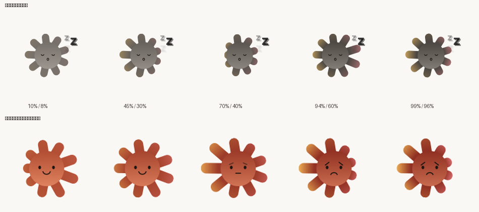

# Sundial · 日晷

一只停在桌面上的小太阳，显示 Claude Code 的实时会话状态和用量限额。
有 macOS 和 Windows 两个版本。

**不需要订阅也能用**——会话状态那半边读的是本地文件，装上就能看；
只有两个用量圈需要 Claude Max / Pro。


## 它显示什么

- **两个仪表**：左边是 5 小时限额，右边是所有周限额里**用得最紧**的那条
  （可能是「每周·全部模型」，也可能是某个模型的专属限额，标签会跟着变）
- **中间的太阳**：表情随用量变化；光芒尖端渐变成对应那侧仪表的颜色，
  越满越亮；哪边限额紧，光芒就往哪边被拽长
- **会话块**：每个正在跑的 Claude Code 会话一块，显示标题、本轮已用时、
  上下文占用。抛出选项等你选时会单独提示
- **空闲时**只剩一颗太阳浮在桌面上，没有卡片、没有底
- **菜单栏/托盘**也有一颗小太阳，有会话在跑时会转



## 安装

**macOS**：从 [Releases](../../releases) 下载 `Sundial.zip`，解压后拖进「应用程序」。
首次打开会被 Gatekeeper 拦住（见下方"关于签名"）。

**Windows**：下载 `Sundial.exe`，双击即可，不用装 .NET。

**登录是可选的。** 有 Claude Max / Pro 的话，右键菜单 → 登录，走一次浏览器授权
就能看到用量圈。没有订阅的话授权页会直接拒绝（提示「连接 Claude Code 需要
Claude Max 或 Pro」），跳过即可——会话状态、上下文占用照常工作。

授权页上写的「或使用 API 密钥」对这个用途没用：那是另一套计费方式，
没有"订阅用量"这个数。

## 自己构建

```bash
# macOS（需要 Xcode 命令行工具）
cd 源码 && ./build.sh          # 本机调试
./build.sh share               # 通用二进制（Intel + Apple 芯片）

# Windows 版（在 macOS 或 Linux 上交叉编译也可以，需要 .NET 10 SDK）
cd Windows源码 && ./构建.sh x64
./构建.sh check                # 只跑验证
```

## ⚠️ 请先读这一段

**这是一个非官方的个人项目，与 Anthropic 没有任何关系。**

它有两处依赖是不受保障的，你应当知情后再决定是否使用：

1. **它复用了 Claude Code 自己的 OAuth `client_id`**，而不是独立申请的凭据。
   这个 ID 本身不是秘密，但用第三方程序走它的授权流程**可能不符合 Anthropic
   的服务条款**。风险由使用者自负；也不排除这条流程日后被收紧。
2. **用量数据取自未公开接口** `GET /api/oauth/usage`。它没有任何兼容性承诺，
   随时可能改动或消失。真出问题时，App 会显示"接口返回了看不懂的数据"而不是
   编一个数字给你。

这两条**只影响用量圈**。会话状态那半边只读本地的 `~/.claude`（Windows 是
`%USERPROFILE%\.claude`）下的记录文件，不依赖任何接口，也不需要账号。
而且只读类型、时间戳、忙闲标记和 token 计数这几个字段，不读对话正文。

令牌只存在本地（macOS 存在应用支持目录、权限 0600；Windows 用 DPAPI 加密），
不上传到任何地方。本项目不收集任何数据。

## 关于签名

macOS 版是 ad-hoc 签名、**未经公证**（作者只有免费的 Apple Development 证书，
签不了 Developer ID）。首次打开需要去掉隔离属性：

```bash
xattr -dr com.apple.quarantine /Applications/Sundial.app
```

## 已知限制

- Windows 版只支持原生安装的 Claude Code，读不到 WSL 里的会话记录（用量圈不受影响）
- 图标不随系统明暗自动切换（macOS 的传统 `.icns` 没有这个能力；
  深色版图标在 `源码/Sundial-dark.icns`，跑一次 `源码/图标/生成图标.sh dark` 可切换）
- Windows 版的卡片底是自绘的半透明圆角底，不是系统亚克力——亚克力只认整块
  方形窗口，而这只桌宠形状每帧都在变，开了反而会在圆角外露出方底
- 从未在 Intel Mac、macOS 13/14/15 上实机验证过；Windows 版的托盘菜单、
  开机自启、亚克力模糊也未在真机上逐项验证

## 许可

MIT，见 [LICENSE](LICENSE)。
