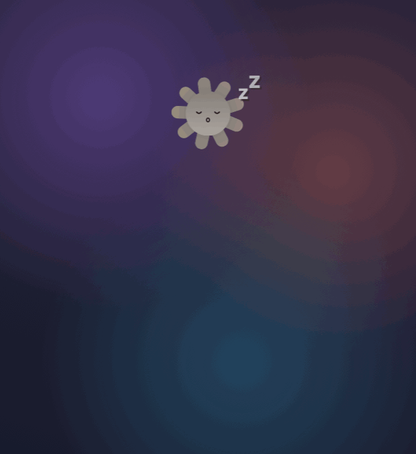
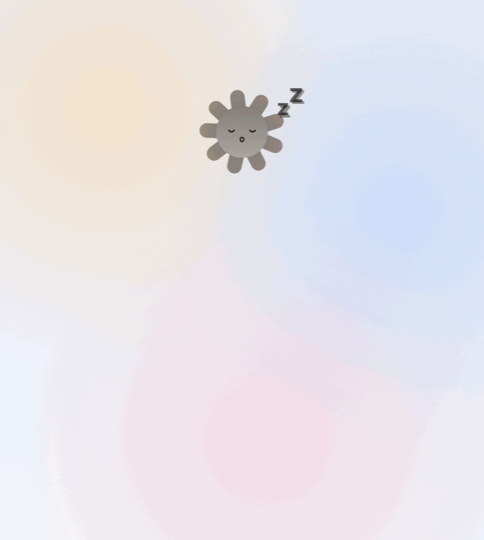
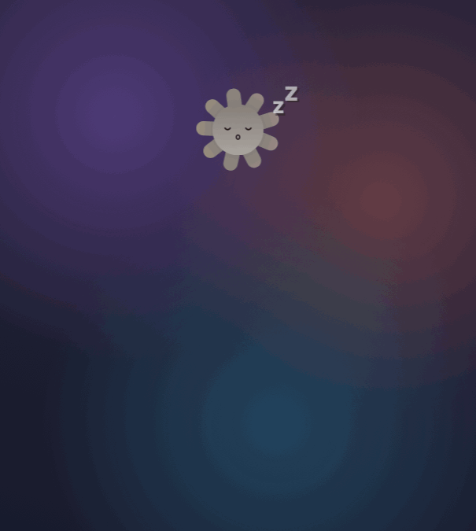

# Sundial · 日晷

*English · [简体中文](README.zh-CN.md)*

A small sun that sits on your desktop, showing live Claude Code session activity
and how much of your usage allowance is left. macOS and Windows.

**A subscription is not required.** The session half reads local files, so it
works the moment you install it; only the two usage dials need Claude Max or Pro.

> **An unofficial personal project. It is not affiliated with Anthropic, nor
> endorsed or supported by them.** The usage half depends on an undocumented
> endpoint and may stop working at any time — see [Please read this first](#-please-read-this-first).
>
> Written with Claude Code, reviewed and tested by a human.

<p align="center">
  
  
</p>

<p align="center"><sub>
Left: light mode · Right: dark mode (follows the system setting)<br>
Dozing → expand on hover → a session begins → the rays reach towards the cursor →
left alone, the dials pull and push the rays into a slow breath → finished, unread → folded away
</sub></p>

<p align="center">
  
  
</p>

<p align="center"><sub>
With nothing running, the gravity reverses: the sleeping sun <em>shies away</em> from
the cursor rather than reaching for it — rays drawn in on the near side, pushed out on the far side.
</sub></p>

---

## Download

Grab the latest build from [Releases](../../releases):

| Platform | File | Notes |
|---|---|---|
| macOS 13+ | `Sundial-x.y.z-macOS.zip` | Universal binary; runs on both Intel and Apple silicon |
| Windows 10/11 | `Sundial-x.y.z-Windows-x64.exe` | Self-contained; no .NET installation needed |

**Opening it for the first time on macOS.** The app is not notarised by Apple,
so Gatekeeper will stop it. Either drag it into Applications and run this once
in Terminal:

```bash
xattr -dr com.apple.quarantine /Applications/Sundial.app
```

…or avoid the terminal entirely: double-click, let it be blocked, then open
**System Settings › Privacy & Security**, scroll down to the notice about
Sundial, and choose **Open Anyway**.

**Opening it for the first time on Windows.** SmartScreen will show a blue
warning, because the executable is not signed with a Microsoft code-signing
certificate. Choose **More info → Run anyway**.

---

## What it does

### Two usage dials (Max / Pro only)

A ring sits on either side of the sun, with the percentage in the middle and a
label beneath.

- **Left ring (honey gold)** — the five-hour allowance.
- **Right ring (apricot pink)** — whichever weekly allowance is under the most
  pressure. That may be *Weekly · all models*, or a limit belonging to one
  particular model. Whichever is tightest is the one shown, and the label
  changes with it.

Details worth knowing:

- The arc fills **clockwise** from the top, easing smoothly as the figure changes.
- **Overruns are shown honestly.** If the endpoint returns 106%, it says 106%
  rather than clamping to 100. Clamping would suggest you had *just* run out,
  hiding how far past the line you actually are.
- The easing state is **kept per ring position, not per label**. The limit shown
  on the right changes identity from time to time; keeping state by label means a
  newly promoted label has no history and grows from zero, which reads as usage
  suddenly collapsing (measured: a jump from 216° to 54° in a single frame).

### The sun is itself the indicator

Even folded down to a single sun, a glance tells you where things stand.

- **Its expression** follows usage: a broad grin when there is room, a flat line
  around halfway, a frown as the limit approaches. Eyebrows only appear once
  things get tight, angled high on the inside.
- **Its colour** deepens continuously with usage, rather than stepping between bands.
- **The ray tips** take on the colour of the dial on that side, and **glow
  brighter the fuller it gets**. The gradient sits only at the far end — the
  roots keep the body colour, so the colour reads as having been picked up
  *from* the dial.
- **Ray length** is pulled by the dials on either side: whichever allowance is
  tightest draws the rays towards it, and it does so as **a breath that both
  attracts and repels** — reaching out on the positive half-cycle, drawing back
  on the negative. The fuller the allowance, the faster the breathing. The two
  sides run in opposite phase, so the whole corona sways.
- **Cursor gravity.** As the pointer approaches — from outside the window, not
  just within it — the rays are drawn towards it, the body leans in slightly, the
  eyes follow, and the grin widens. While dozing this reverses: the rays shy away
  and the body draws back.
- **Dozing.** With no session running the sun turns grey, closes its eyes and
  drifts a few z's. The usage signal survives even then, in the brightness of the
  ray tips, so the folded state is never entirely mute.

### Session blocks

One block per running Claude Code session, up to four:

- Session title, what it is doing, and **how long the current turn has been running**.
- **Context consumption** (for instance `824.8k / 1.0M`, 82%). The bar deepens
  towards red past 60%; when it nears the top, it is time to start a fresh
  session. This figure needs no subscription.
- Status: `Thinking` · `Waiting for you` (a session asking a question **jumps to
  the top**) · `Background task running` · `Unread · just finished` ·
  `Not responding · no update for N min`.
- Click a block to dismiss the "finished but unread" marker.
- Blocks **roll** in and out, with the ones below sliding up in step, rather than
  appearing and vanishing on the spot.

Working out *when* things happened turned out to be the fiddly part, and several
faults have been fixed along the way: the turn's start is anchored to the user's
message itself (locating it via `last-prompt` runs 112 seconds late); pressing
Esc clears the start; placeholder records left by API errors are no longer taken
as the end of a turn; and a timeout reports *not responding* rather than
pretending the work finished.

### The interface

- **When idle, only the sun remains**, floating on the desktop with no card and
  no backing.
- Hovering expands it; moving away folds it up. Folding uses an S-curve over
  0.62 s, and the dials fade out ahead of the window — otherwise they are cut off
  by the window edge and appear to snap out of existence.
- On macOS the card is the system's **Liquid Glass** (`NSGlassEffectView`); on
  Windows it is a hand-drawn translucent panel (see [Known limitations](#known-limitations)).
- It follows the system **light / dark** setting, and both palettes have had
  their contrast measured item by item.
- Drag to move it; the position is remembered. The glass takes on a warm tint
  while a session waits for your input.
- There is a small sun in the **menu bar / system tray** too, and **it turns
  while a session is running**.

### Everything else

- Context menu: sign in / sign out, refresh now, keep the usage breakdown open,
  open the web usage page, clearer glass, always on top, launch at login, bring
  the pet back to the centre of the screen, quit.
- The current version number sits at the top of the menu — worth quoting in any
  bug report.
- System accessibility settings are respected: **Reduce Motion** disables the
  cursor-following displacement, **Reduce Transparency** substitutes an opaque panel.
- Power: idle drops to 24 fps and disk polling slows down. **While a session is
  running, however, it does use CPU continuously** — full-frame custom drawing
  plus a transcript poll every 0.8 s, measured at roughly a third of one core
  (28–37% on macOS). On a laptop it will sit fairly high in Activity Monitor.
  The macOS build stops entirely when the display sleeps; the Windows build does
  not yet manage this.

---

## Using it without a subscription

The two halves of the app are independent:

| | Where the data comes from | Account needed? |
|---|---|---|
| Session state, context consumption | Local transcript files under `~/.claude` | **No** |
| The two usage dials | Anthropic's endpoint | Max / Pro |

Without a subscription, Claude's authorisation page states plainly that
connecting Claude Code requires Max or Pro, and refuses. **That is expected —
simply skip signing in.** The sun and the session blocks carry on as usual.

The "or use an API key" option on that page does not help here: it is a
different billing arrangement, with no *subscription allowance* figure to show.

### Even with a subscription, most people never sign in

There are two ways the dials can obtain credentials, and **the first is the default**:

1. **Reuse the credentials Claude Code already holds** (Keychain, or
   `~/.claude/.credentials.json`). If you have signed in to the command-line
   Claude Code, this simply works — **the dials are there on first launch, and no
   authorisation flow takes place at all**.
2. **Have Sundial sign in itself** — needed only when the first route finds
   nothing. The usual reason is that you are using the **desktop** Claude Code,
   which keeps its sign-in elsewhere.

In other words, *Sign in to Claude account* in the menu is a fallback rather than
a required step. If the dials are already turning, you can ignore it.

---

## Building it yourself

```bash
# macOS (requires the Xcode command line tools)
cd src
./build.sh              # local debug build, installed alongside the repository
./build.sh share        # universal binary (Intel + Apple silicon), packaged into dist/
./build.sh release      # requires a Developer ID certificate; includes notarisation

# Icons (only needed after changing the shape of the sun)
./icon/make-icons.sh          # light background
./icon/make-icons.sh dark     # dark background

# Windows build, cross-compiled on macOS (requires the .NET 10 SDK: brew install dotnet)
cd src-windows
./build.sh x64           # win-x64
./build.sh arm64         # win-arm64 (Snapdragon X and similar)
./build.sh check         # verification only: core logic plus offscreen renders to PNG
```

The `VERSION` file at the repository root is the single source of truth for the
version number; both build scripts read it.

---

## Repository layout

```
VERSION                     single source of truth for the version number
src/                        macOS build (Swift + AppKit)
  ├ PetView.swift           all drawing and animation state
  ├ App.swift               window, menus, tray, power, accessibility
  ├ Activity.swift          reads Claude Code transcripts
  ├ Usage.swift             usage endpoint parsing and fetch scheduling
  ├ Auth.swift              OAuth PKCE and token storage
  ├ Model.swift / Theme.swift
  └ icon/                   icon generator
src-windows/                Windows build (C# + Avalonia)
  ├ src/Sundial.Core/       pure logic, no UI dependency — testable on macOS
  ├ src/Sundial.App/        Avalonia interface
  └ tests/
     ├ LiveCheck/           runs the core layer against real local transcripts
     └ RenderCheck/         renders offscreen to PNG for frame-by-frame comparison with macOS
dist/                       packaged builds produced by `./build.sh share`
docs/                       images used by this README
  └ make-demo.swift         offscreen frame-by-frame renderer for the demo GIFs
                            (not a screen recording — reruns are identical)
NOTES.md                    maintenance notes: design decisions and the traps hit along the way
```

Both platforms share the same shape parameters and behavioural logic; fifteen
key constants are compared item by item to keep them in step.

---

## Data and privacy

The session half **only reads local files**. What it reads is set out below in
some detail, because "it doesn't read your messages" is the sort of claim that
is very easily overstated:

| What is read | What for | Displayed? |
|---|---|---|
| Record type, timestamps | Busy/idle detection, elapsed time for the current turn | No |
| `custom-title` / `ai-title` | Session title | **Yes** — permanently, on your desktop |
| Token counts, model name | Context consumption percentage | Yes (the figures only) |
| The **opening characters** of user messages | Recognising `[Request interrupted` (Esc) and `<task-notification` (background task finished) | No |

That last row deserves to be spelt out: the parser **does read the text of your
messages into memory** — [Activity.swift](src/Activity.swift) assembles it into
a string in order to test its prefix. It is not displayed, not retained and not
sent anywhere, but saying the app "never touches your messages" would not be accurate.

Note also that **session titles are shown on your desktop**. If a title contains
something sensitive, it is visible in screenshots and while screen-sharing.

- The sign-in token is stored locally only: on macOS in the application support
  directory (mode 0600), on Windows encrypted with DPAPI, so only your account
  can read it.
- Apart from the usage endpoint described below, nothing is sent anywhere. No
  analytics, no crash reporting.

---

## ⚠️ Please read this first

**This is an unofficial personal project with no connection to Anthropic.**

Two of its dependencies come with no guarantees whatsoever.

1. **Usage figures come from an undocumented endpoint,** `GET /api/oauth/usage`.
   Nothing about it is promised to remain stable; it may change or disappear at
   any time. When that happens the app will say it received data it could not
   make sense of, rather than inventing a figure for you.
2. **The fallback sign-in route reuses Claude Code's own OAuth `client_id`**
   instead of credentials registered for this app. The identifier itself is not a
   secret, but putting a third-party program through that authorisation flow
   **may not be consistent with Anthropic's terms of service**, and the route may
   well be tightened in future. The default route — reusing credentials that
   already exist — is unaffected, as it makes no authorisation request at all.

Realistically the consequence of both is that **the dials stop turning one day**,
not that something happens to your account: reading usage is a single `GET`,
writes nothing, and consumes no allowance.

One point does need stating plainly, though: **the fallback sign-in requests
broader permissions than reading usage requires.** The scope is
`org:create_api_key user:profile user:inference`
([Auth.swift:14](src/Auth.swift#L14)) — Claude Code's own set, carried over
verbatim rather than pared down to what this app needs. Sundial uses it solely to
call the usage endpoint, but **the scope you approve on the authorisation page is
genuinely wider than that**. If that bothers you, do not take this route; reusing
existing credentials makes no authorisation request.

**Both points affect the usage dials only.** The session half reads local
transcript files, depends on no endpoint, and needs no account.

---

## Known limitations

- The macOS build is ad-hoc signed and **not notarised** (only a free Apple
  Development certificate is available, which cannot produce a Developer ID
  signature), so the quarantine flag has to be cleared by hand on first launch.
- The Windows build supports only a **natively installed** Claude Code; it cannot
  see transcripts inside WSL. The usage dials are unaffected.
- The Windows card is a hand-drawn translucent panel rather than system acrylic.
  Acrylic applies only to a whole rectangular window, and this pet changes shape
  every frame, so enabling it exposes a rectangular backing outside the rounded
  corners. There is an experimental switch in the menu; either way this aspect
  remains a notch behind the macOS build.
- The icon does not follow the system light/dark setting — the traditional macOS
  `.icns` format cannot express that. A dark version lives at
  `src/Sundial-dark.icns`; run `./icon/make-icons.sh dark` to switch.
- **Not yet verified on real hardware:** Intel Macs, macOS 13/14/15, VoiceOver
  actually speaking the interface, and on Windows the tray menu, launch at login
  and acrylic blur. The Windows sign-in flow *has* been verified on real hardware.

---

## Licence

MIT — see [LICENSE](LICENSE).
